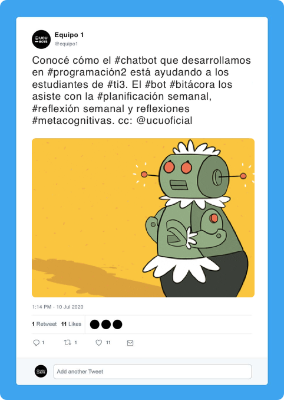

## Bot I

### Consigna

El chatbot consiste en un bot _"asistente de bitácora"_, especializado en asistir a los alumnos del Taller Interdisciplinario de Introducción a la Ingeniería (TI3) con su bitácora personal. #AyudamosALosMasChicos

#### Bitácora

La bitácora es una herramienta de planificación que presenta varias entradas (estilo diario) de distinta índole:

- Objetivos semanales (3 o más, llamados "victorias")

- Planificación semanal día a día

- Reflexión de la planificación semanal (al final de la semana reflexiono sobre la planificación que hice al comienzo)

- Reflexión metacognitiva (luego de cada clase)

El formato actual de la bitácora es un archivo Word con lo último al comienzo que es revisado por los docentes y ayudantes del curso.

#### Asistente de bitácora

El bot asistirá a los participantes del curso en la creación de sus entradas a la bitácora, presentándoles notificaciones luego de las clases para que hagan sus entradas metacognitivas, y los fines de semana para la reflexión y planificación semanal.

Las entradas que se hagan en el chat serán impactadas por el bot en las salidas que correspondan (por ejemplo, en el archivo Word) con el formato correspondiente.

#### Formato

Distintos estudiantes utilizan distintos formatos de bitácora, especialmente para la planificación semanal: algunos usan una tabla, otros listas con puntitos, otros listas en formato bullet journal (círculos para los eventos, puntos para las tareas, asterisco para los ítems importantes), etc.

Además, el bot debe permitir escribir la bitácora en varios formatos distintos; mínimamente en archivos Word y Markdown.

#### Mantenibilidad

El bot debe poder ser capaz de ser modificado mediante configuración para actualizar algunos de sus elementos, por ejemplo, el formato de las entradas (ver _Formato_), si la última entrada va al comienzo o al final, cuándo se envían alertas, el comienzo y final del semestre, entre otros.

Es imprescindible que maneje correctamente las abstracciones necesarias para esto, y que se utilice algún banco de datos externo a la aplicación que permita modificar estos elementos sin cambiar el código fuente.

#### Plataforma

El bot debe poder ser utilizado por consola y desde otras plataformas de chat (por ejemplo, Telegram, WhatsApp, Messenger, etc.). Es necesario integrarlo al menos con una de ellas.

### Completitud de la Consigna

Esta consigna es parcialmente completa. Naturalmente, durante el desarrollo del proyecto surgirán interrogantes sobre la especificación del bot. Dichas consultas serán evacuadas por el _product owner_ de este proyecto: Juan Sapriza.

----

🌎  **¡Los alumnos de TI3 necesitan este bot! Es ahora tarea de ustedes hacerlo realidad.** 👨‍💻👩‍💻

---

##### Proyecto 2020 - Primer Semestre - Letra
###### FIT - Universidad Católica del Uruguay
