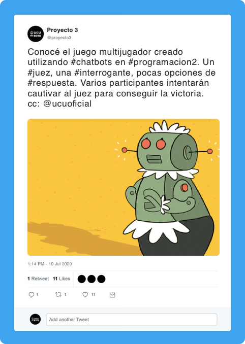

## Bot III



### Consigna

El chatbot consiste en un juego de estilo trivia con juez. El juego más famoso con esta mecánica es Cards Agains Humanity.

#### Mecánica del juego analógico

Existen 2 tipos de cartas: "a completar" y "respuesta"

- Se reparten 10 cartas de _respuesta_ para cada jugador

- Se designa un juez

- El juez toma una carta _a completar_ y la lee/muestra

- Los demás jugadores escogen una carta de _respuesta_ de su mano y se la entregan boca abajo al juez

- El juez baraja todas las cartas de _respuesta_ que le fueron dadas. Les lee y escoge la que más le gusta. El dueño la carta de _respuesta_ escogida por el juez se lleva un punto

- El juez rota a otro jugador

- Se repite el proceso

#### Variantes originales

Las cartas _a completar_ del juego donde las cartas son:

- Texto, que le falta una porción. Por ejemplo: "Lo que más me gusta de programar es ____________"

- Fotos, por ejemplo, memes sin texto, como este:


#### Bot

El bot deberá orquestar este juego en formato digital. Debe presentar al menos las siguientes 4 opciones de juego:

- **Texto y cartas de respuesta**: El bot presenta una frase a completar y cada jugador escoge una carta de respuesta para completarla.

- **Texto y respuesta libre**: El bot presenta una frase a y cada jugador envía una respuesta escribe libremente (con el teclado).

- **Imagen y cartas de respuesta**: El bot presenta una imágen y cada jugador escoge una carta de respuesta para completarla.

- **Imagen y respuesta libre**: El bot presenta una imagen y cada jugador envía una respuesta escribe libremente (con el teclado).

#### Cartas

Las cartas (texto a completar, imagenes, cartas de respuesta) pueden ser importadas desde un archivo CSV (separado por comas) con un formato similar al siguiente:

```
tipo,mazo,texto,imagen
"texto","incompleta","Nada me cansa mas que ____________",""
...
"texto","respuesta","Escribir tests unitarios",""
"texto","respuesta","Los profes",""
"texto","respuesta","El ejercicio de Roleplay",""
"texto","respuesta","Un chatbot no que funciona",""
...
"imagen","incompleta","","/Users/juan/Documents/images/1.png"
"imagen","incompleta","","/Users/juan/Documents/images/2.png"
...
```

#### Mantenibilidad

El bot debe poder ser capaz de ser modificado mediante configuración para actualizar algunos de sus elementos, por ejemplo, las rondas que dura un juego, el tiempo límite para contestar, etc.

Es imprescindible que maneje correctamente las abstracciones necesarias para esto, y que se utilice algún banco de datos externo a la aplicación que permita modificar estos elementos sin cambiar el código fuente.

Además, se debe poder actualizar el mazo de cartas utilizando el importador mencionado anteriormente.

#### Plataforma

El bot debe poder ser utilizado por consola y desde otras plataformas de chat (por ejemplo, Telegram, WhatsApp, Messenger, etc.). Es necesario integrarlo al menos con una de ellas.

### Completitud de la Consigna

Esta consigna es parcialmente completa. Naturalmente, durante el desarrollo del proyecto surgirán interrogantes sobre la especificación del bot. Dichas consultas serán evacuadas por el _product owner_ de este proyecto: Nicolás Alliaume.


----

🌎  **¡El mundo necesita este bot! Es ahora tarea de ustedes hacerlo realidad.** 👨‍💻👩‍💻

---


##### Proyecto 2020 - Primer Semestre - Letra
###### FIT - Universidad Católica del Uruguay
