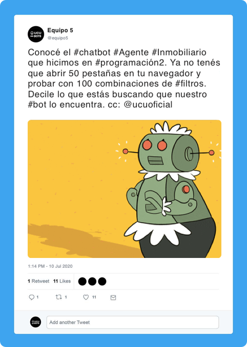

## Bot V

### Consigna

El chatbot consiste en un bot _"agente inmobiliario"_, especializado en encontrar propiedades.

El bot hará preguntas a los usuarios sobre lo que estan buscando (tipo de propiedad, rango de precio, prestaciones, ubicación, etc.) y el bot les presentará opciones reales disponibles (recomendaciones). El bot debe ir ajustando el filtro hasta llegar a un conjunto de opciones aceptables o hasta que se cancele la comunicación.

#### Presentación de opciones

El bot presentará al usuario opciones de propiedades reales. Estas serán obtenidas de varios sitios de inmuebles existentes. Por ejemplo: [InfoCasas](https://infocasas.com.uy), [Mercado Libre](https://www.mercadolibre.com.uy/inmuebles), [Gallito](https://www.gallito.com.uy/inmuebles), etc.

El bot debe ir un paso más allá que los sitios web de inmuebles tradicionales y asemejarse más a un agente inmobiliario real. Por ejemplo, cuando un filtro de precio está entre 20000 y 30000, debería presentar (o al menos preguntarle al usuario) si quiere ver algunas opciones que están un poquito por encima o por debajo del rango (si cumplen el resto de las condiciones).

#### Mantenibilidad

El bot debe poder ser capaz de ser modificado mediante configuración para actualizar algunos de sus elementos, por ejemplo, las preguntas que se le hacen al usuario, los filtros que se utilizan, entre otros.

Es imprescindible que maneje correctamente las abstracciones necesarias para esto, y que se utilice algún banco de datos externo a la aplicación que permita modificar estos elementos sin cambiar el código fuente.

Además, debe ser extensible en cuanto a los sitios externos desde donde se obtienen opciones de inmuebles.

#### Plataforma

El bot debe poder ser utilizado por consola y desde otras plataformas de chat (por ejemplo, Telegram, WhatsApp, Messenger, etc.). Es necesario integrarlo al menos con una de ellas.

### Completitud de la Consigna

Esta consigna es parcialmente completa. Naturalmente, durante el desarrollo del proyecto surgirán interrogantes sobre la especificación del bot. Dichas consultas serán evacuadas por el _product owner_ de este proyecto: Federico Martino.

----

🌎  **¡El mundo necesita este bot! Es ahora tarea de ustedes hacerlo realidad.** 👨‍💻👩‍💻

---

##### Proyecto 2020 - Primer Semestre - Letra
###### FIT - Universidad Católica del Uruguay
